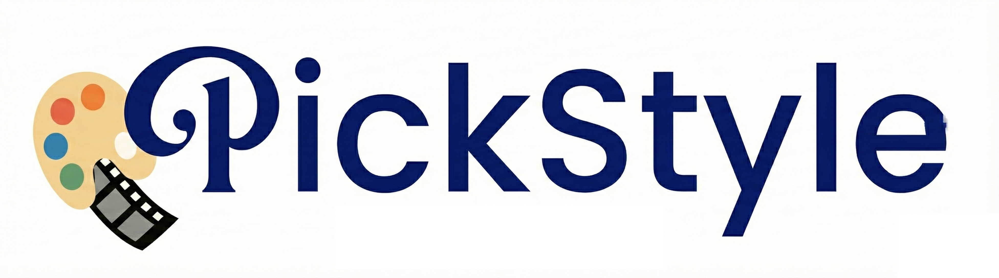

# PickStyle: Video-to-Video Style Transfer with Context-Style Adapters

<div style="text-align: center;">
    <br>
        <a href="https://arxiv.org/abs/2510.07546"></a>
        <a href="https://pickstyle.pickford.ai/"></a>
        <a href="https://huggingface.co/Pickford/PickStyle/"></a>
        <a href="https://huggingface.co/datasets/Pickford/PickStyle-Dataset/"></a>
    <br>
</div>

## 🎉 News
- [x] Dec 31, 2025: 🔥Release code of model training code, checkpoints, and demo.
- [x] Oct 8, 2025: We propose [PickStyle](https://pickstyle.pickford.ai/), Video-to-Video Style Transfer with Context-Style Adapters.

## ⚙️ Installation
The codebase is tested with Python 3.11, Cuda 12.8, and torch 2.5.1.

You can install the dependencies by:
```bash
pip install psutil torch==2.5.1 torchvision==0.20.1
pip install flash_attn --no-build-isolation
pip install -r requirements.txt
```

PickStyle is built upon Wan2.1-VACE-14B. you can download the checkpoints using huggingface-cli:
```bash
mkdir models
hf download Wan-AI/Wan2.1-VACE-14B --local-dir models/Wan2.1-VACE-14B
```
Next, you need to download the weights of PickStyle style adapters:
```bash
hf download Pickford/PickStyle --local-dir models/PickStyle
```

## 🚀 Demo Usage
You can run the demo using:
```bash
python3 vace/vace_wan_inference.py --ckpt_dir models/Wan2.1-VACE-14B \
                                    --model_name vace-14B \
                                    --pretrained_lora_path models/PickStyle/pickstyle_lora.pth \
                                    --src_video <src_video_path> \
                                    --save_file <out_video_path> \
                                    --adapter_name consistency \
                                    --prompt "<style> style. <short_description>" \
                                    --lora_rank 128 \
                                    --lora_alpha 128 \
                                    --t_guide 5 \
                                    --c_guide 4 \
                                    --enable_teacache --use_ret_steps \
                                    --sample_steps 20 \
                                    --skip <skip>
```
Things you need to change:
- `<src_video_path>`: path to the source video.
- `<out_video_path>`: path to save the output video.
- `--prompt`: The style and short description of the video content.
- `--skip`: Denoising steps to skip. Higher values lead stronger similarity to the original video and less stylization. You can refer to paper supplementary for more details on this parameter.

An example:
```bash
python3 vace/vace_wan_inference.py --ckpt_dir models/Wan2.1-VACE-14B \
                                    --model_name vace-14B \
                                    --pretrained_lora_path models/PickStyle/pickstyle_lora.pth \
                                    --src_video assets/videos/boxing.mp4 \
                                    --save_file out.mp4 \
                                    --adapter_name consistency \
                                    --prompt "Anime style. A boxer in white gloves trains inside a dimly lit gym, striking a hanging heavy bag while another athlete watches from the ring in the background." \
                                    --lora_rank 128 \
                                    --lora_alpha 128 \
                                    --t_guide 5 \
                                    --c_guide 4 \
                                    --enable_teacache --use_ret_steps \
                                    --sample_steps 20 \
                                    --skip 4
```

## 🤖 Training
To train the model, you have to download the dataset first. The dataset is made of images using our Pickford AI's first date project in Unity3D and anime, pixar, and clay styles and a subset of [OmniConsistency](https://huggingface.co/datasets/showlab/OmniConsistency) dataset. You can download these two datasets from HuggingFace:
```bash
mkdir datasets
huggingface-cli download Pickford/PickStyle-Dataset --local-dir datasets/ --repo-type dataset
```
Next, you can run the training. We used 32xH100s for training the model for 12 hours:
```bash
torchrun \
  --nnodes=4 \
  --node_rank=<node-rank-for-multi-node-training> \
  --master_addr=<master-address> \
  --master_port=1234 \
  --nproc_per_node=<num-gpus-per-node> \
  train/train_vace_lora.py \
  --config train/config/pickstyle.yaml \
  --wandb-name <name-for-wandb-run> 
```

## Acknowledgement
We sincerely thank the authors of [Wan](https://github.com/Wan-Video/Wan2.1) and [VACE](https://ali-vilab.github.io/VACE-Page/) for their outstanding work, which provided invaluable foundations and inspiration for this project. We also thank [OmniConsistency](https://github.com/showlab/OmniConsistency) for generously providing the data used in our experiments.


## BibTeX

```bibtex
@article{mehraban2025pickstyle,
  title={PickStyle: Video-to-Video Style Transfer with Context-Style Adapters},
  author={Mehraban, Soroush and Adeli, Vida and Rommann, Jacob and Taati, Babak and Truskovskyi, Kyryl},
  journal={arXiv preprint arXiv:2510.07546},
  year={2025}
}
```